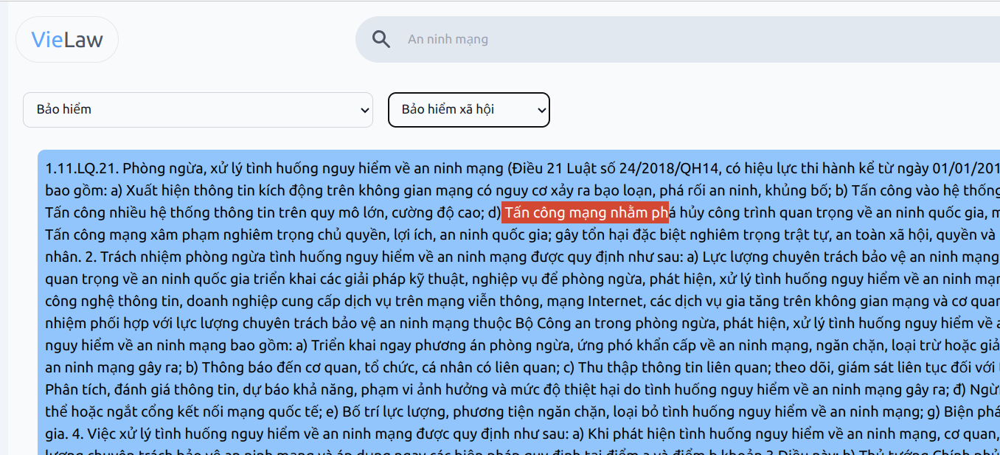

# VieLaw


Xem trang này dưới ngôn ngữ khác:

- [English](./docs/README_en.md)

## Tính năng

1. Chatbot hỗ trợ thông tin - Test tại đây: https://huggingface.co/nhantran0506
2. Tra cứu pháp điển

## Demo


Tra cuu bang ChromaDB


## Tải xuống

Tất cả mã nguồn của dự án đều sẵn sàng trên Internet, bạn có thể tạo bản sao bằng lệnh sau để bắt đầu tham gia đóng góp vào dự án mã nguồn mở

```
    git clone git@github.com:toantc1024/vielaw.git
```

## Cài đặt

`

### 1. Models

Link Github Models sau khi fine tuning của nhóm: https://huggingface.co/nhantran0506/law-llms-v1
Bạn có thể đóng góp vào nguồn mở bằng cách tạo bản sao để chạy trên máy. Bên cạnh đó, bạn có thể dùng API kèm theo đường link trên

### 2. Database

Đối với cơ sở dự liệu, VieLaw sử dụng Open Source SQlite + ChromaDB

### 3. Backend

QUAN TRỌNG!
Đảm bảo các file .env đã được cấu hình

`Backend`

Tạo môi trường ảo để đảm bảo bạn không cài đặt các thư viện cho nặng máy nhe! `requirement python >= 3.9`

```
    python3 -m venv venv
```

Link tới folder chứa backend

```
    cd ./packages/backend/
```

Cài đặt các thư viện

```
    pip install -r requirements.txt
```

Khởi chạy backend

```
    uvicorn main:app --reload
```

Nếu bị lỗi

```
    python3 -m uvicorn main:app --reload
```

### 4. Frontend

Chuyển con trỏ đến thư mục frontend

```
    cd /packages/frontend
```

Cài đặt các thư viện từ `npm`

```
    npm install
```

Khởi chạy dự án VieLaw trên mức frontend

```
    npm run start
```

Microservice frontend sẽ được chạy trên host mặc đinh là `localhost:3000`
Microservice backend sẽ được chạy trên host mặc đinh là `localhost:8000`

## Thông tin khác

[Wiki](./docs/wiki/vi/Introduction.md)

## Mailing list, bug tracker, ...

E-mails: [toantc1024](mailto:tctoan1024@gmail.com)

## Giấy phép và ghi công

### 1. Front End

- Icons: https://react-icons.github.io/react-icons/ - MIT (Hero Icons)
- ReactJS 18 - MIT
- Font family - Google Fonts - MIT
- Redux - MIT
- React Router Dom
- TailwindCSS

### 2. Backend

fastapi==0.104.1
pydantic==2.5.2
PyJWT==2.8.0
PyJWT==2.8.0
uvicorn==0.24.0.post1
python-dotenv==1.0.0

### 3. Database

SQlite

### 4. Models

Pytorch

Mô hình Open Source Sbert để Fine tuning: https://huggingface.co/keepitreal/vietnamese-sbert

## Người đóng góp

## Tài trợ
